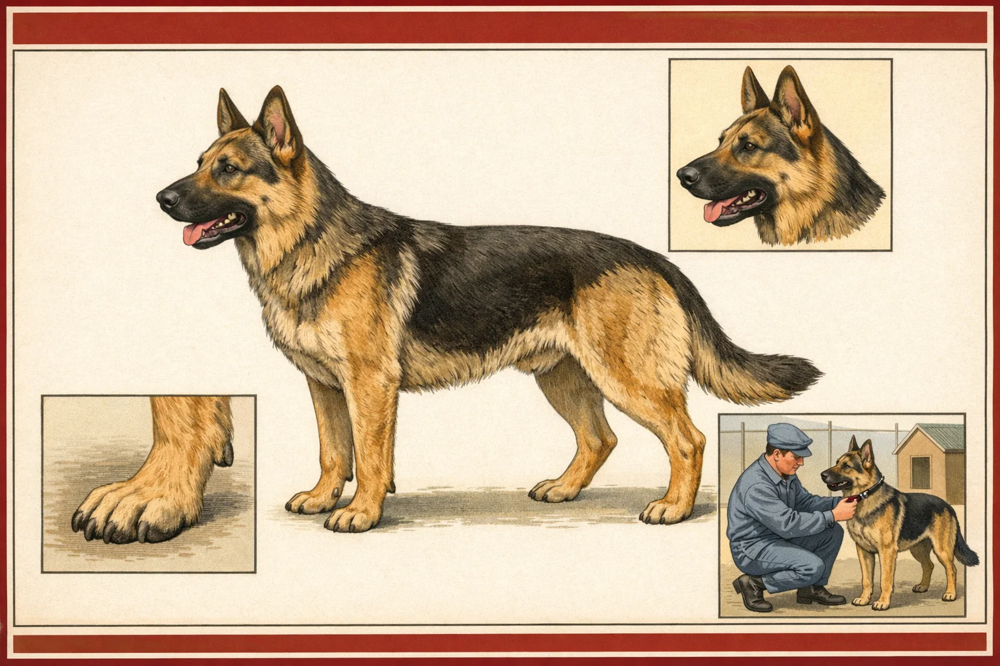
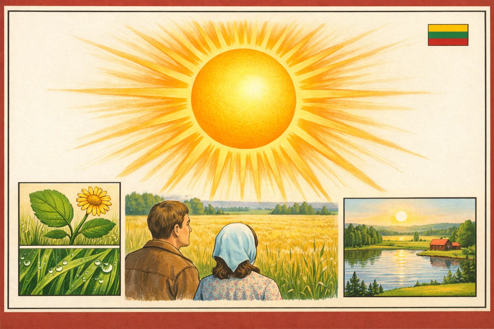
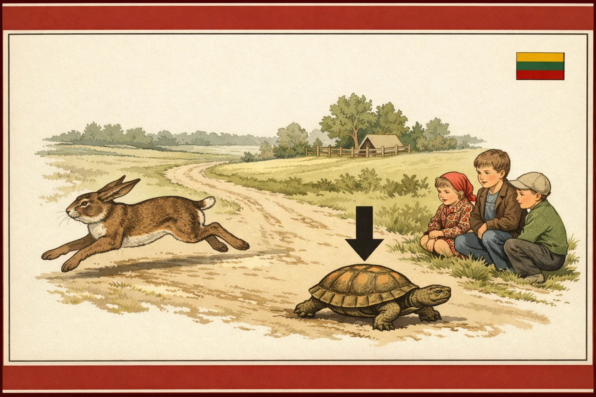
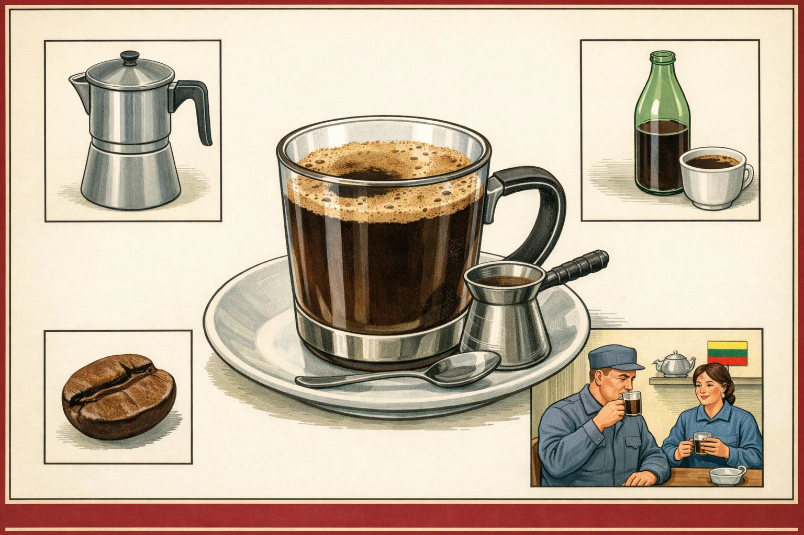
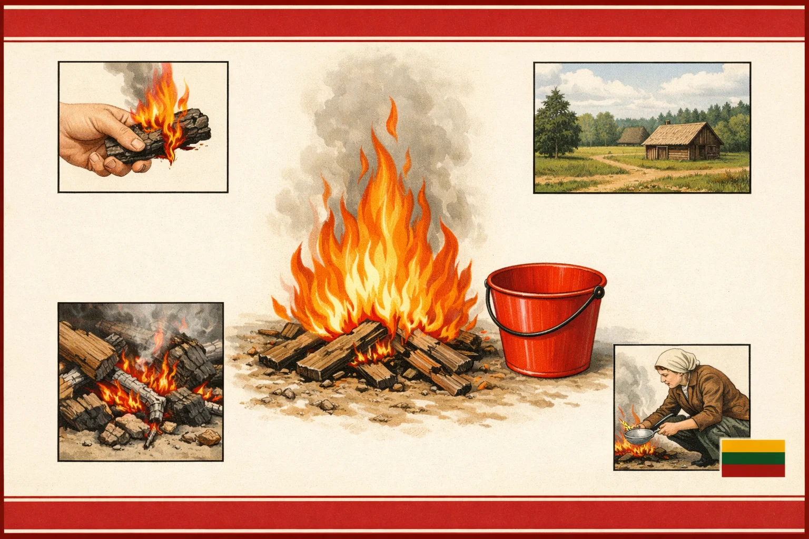
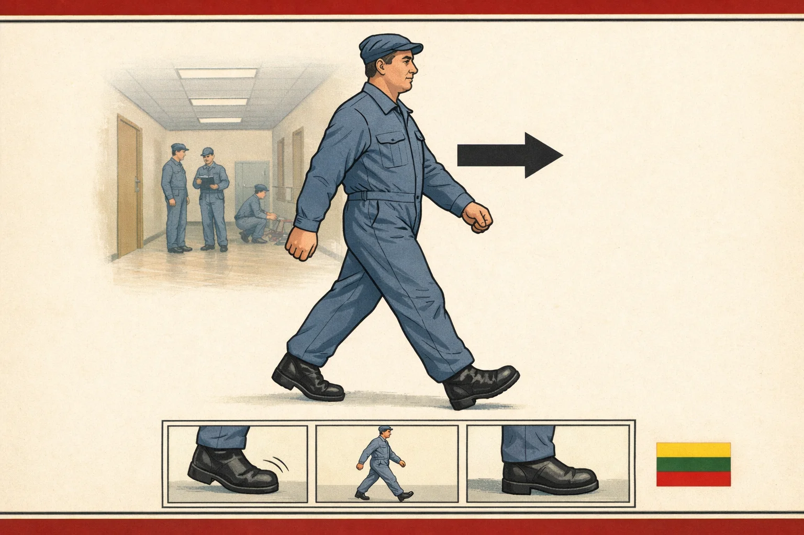
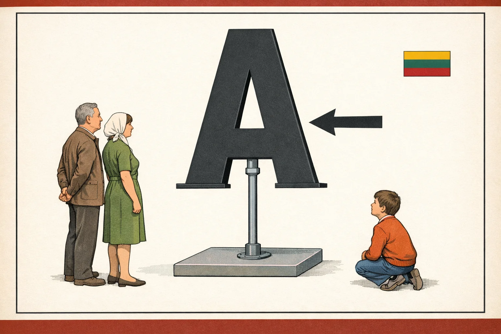

# Lietuvių Flashcards

**A 429-card illustrated Lithuanian vocabulary deck, drawn in the deadpan style of a 1980s Soviet civil-defence training manual.**

Every card teaches one Lithuanian word through a single, *guessable* illustration — no text is baked into the art. The vocabulary lives in a companion CSV so the words render as clean Anki fields. The art is deliberately, sincerely flat: calm instructional wall-chart illustration, muted offset-print colour, anonymous everyperson figures, the occasional small tricolor. The result reads like scanned pages from one fictional publication.

<p align="center">
  
  
  
</p>
<p align="center">
  
  
  
</p>
<p align="center">
  
  
  
</p>

## Get the deck

**Ready-made:** download **`Lietuviu_Flashcards.apkg`** from the
[Releases](https://github.com/dainius-sileika/Lithuanian_Flashcards/releases) page
and double-click it (or File → Import in Anki). It bundles all 519 illustrated
cards, the GO theme, and Lithuanian audio (Azure neural voice).

**Build it yourself** from the source in this repo:
```bash
pip install genanki
python3 build_apkg.py      # reads cards_anki.csv + images/ + audio/ + anki/go_theme.css
```
This writes `Lietuviu_Flashcards.apkg`. Card data is `cards_anki.csv` (word, gloss,
gender, genitive/principal-parts/feminine forms, image, number); pronunciation
audio (one mp3 per card) is in `audio/`; the styling is `anki/go_theme.css`
(see `anki/templates.md` for the note-type layout).

> **Stress accents** in the pronunciation field are sourced, not generated —
> primarily from Wiktionary's stress-marked headwords, with the remainder from
> [kirtis.info](https://kirtis.info). Each is accepted only if stripping its accent
> marks exactly reproduces the plain headword, so a wrong-word match is impossible.
> Coverage is 519/519. Grammar forms (genitive, principal parts, feminine) are
> still being verified by a native speaker — treat those as provisional.

## The idea

The deck follows the [Fluent Forever](https://fluent-forever.com/) principle: learn words from **images**, not translations, so the foreign word attaches directly to a concept. Two design rules keep the images doing the teaching:

- **Guessability gate** — if you *didn't* already know the target word, you should be able to infer it from the main image alone. Insets must support that meaning, never vote for a neighbouring word.
- **No text in the art** — image models can't spell diacritic-heavy Lithuanian reliably, so the word is left to the Anki layer. The picture is pure illustration.

The house style is **"deadpan civic procedure"**: the calm, patient temperature of a civil-defence poster teaching you to survive the unsurvivable with a friendly diagram and no wink. Figures are types, not individuals; the diagram is the voice (arrows, numbered insets, cross-sections). Population follows the setting — civilians at home and in shops, workers where work belongs, white coats at the hospital.

## What's in the box

| Path | What |
|------|------|
| `images/` | The 429 finished cards as WebP (1536×1024, ~100 MB) — the distributed set. |
| `master_wordlist.csv` | The wordlist (v2.5): 429 generable rows — target word, gloss, gender, pronunciation, per-card notes. |
| `out_deck/ledger.csv` | The exact prompt + settings behind every card (full reproducibility). |
| `out_deck/cards.csv` | The Anki fields (Lithuanian, English, pronunciation, gender, category, image). |
| `go_generator.py` | The "GO" image engine — house style, palette, prompt assembly. Backend: OpenAI gpt-image-1.5. |
| `go_grammars.py` | Per-category visual grammars (the executable design bible). |
| `deck_builder.py` | Production runner: routes every wordlist row, applies per-card staging overrides. |
| `driver.py` | Parallel/batch runner; resumable; merges into `out_deck/`. |
| `GO_STYLE_SPEC_files_1_7_1.md` | The canonical art specification + full changelog (v0.1 → v1.7.2). |
| `VERSIONS.md` | Version index. Current: **files 1.7.2 / wordlist 2.5**. |
| `deprecated/` | Frozen older code/wordlist/spec versions for rollback. |

## Categories

Animals · Transportation · Locations · Clothing · Colours · Family & People · Jobs · Food & Drink · Home · Electronics · Body · Nature · Materials · Verbs · Adjectives — plus a handful of abstract/glyph cards.

## Regenerating a card

```bash
pip3 install openai
export OPENAI_API_KEY=sk-...
python3 driver.py <Category> [N] [budget_seconds]   # e.g. python3 driver.py Verbs 5 40
python3 driver.py --reroll 001_suo,245_irankis       # re-roll specific cards
```
The engine is model-independent by design: the grammars and staging survive a backend swap; only the prompt phrasing adapts.

## License

**[CC BY-NC 4.0](LICENSE)** — free to use, share, and adapt for **non-commercial** purposes, **with attribution** and a link back. Applies to the artwork, wordlist, spec, and code.

> "Lietuvių Flashcards" by Dainius Sileika, licensed under CC BY-NC 4.0.
> Source: https://github.com/dainius-sileika/Lithuanian_Flashcards

*Note: the illustrations were produced with OpenAI gpt-image-1.5. The copyright status of purely AI-generated images is legally unsettled; this license expresses the author's intent and covers the curated collection, wordlist, spec, and code. See [LICENSE](LICENSE) for detail.*

## Status

**Complete** — 429/429 cards generated and QA'd under files 1.7.2 / wordlist 2.5. Full-resolution PNG masters are kept locally; this repo carries the compressed WebP set.
